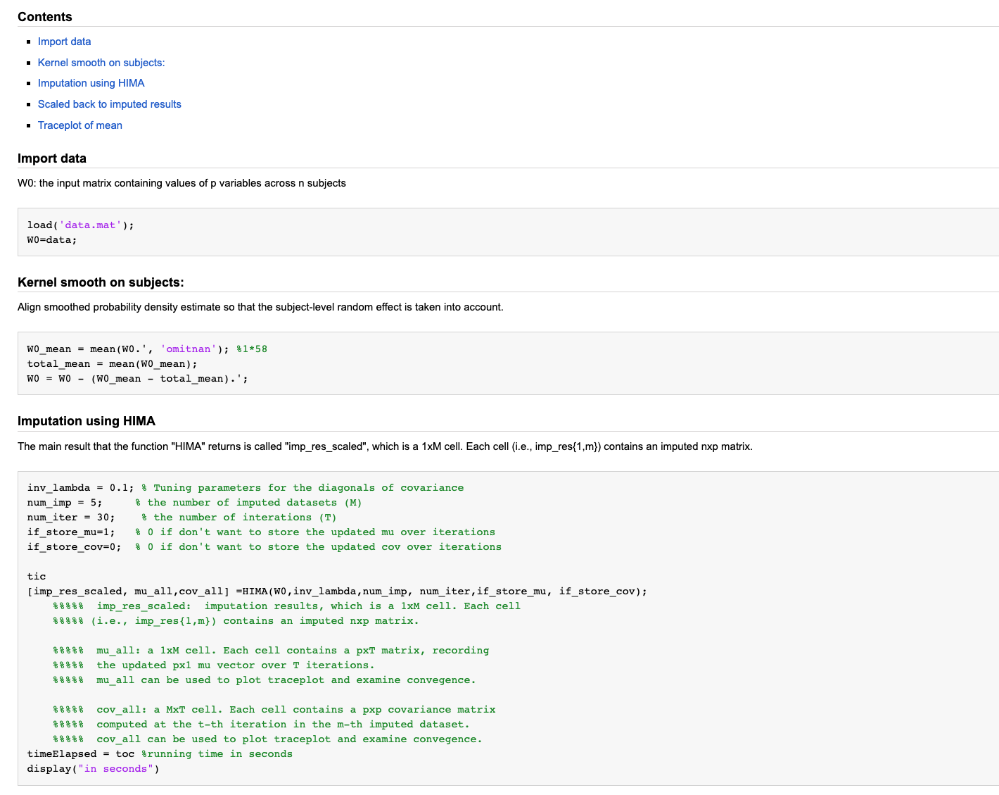
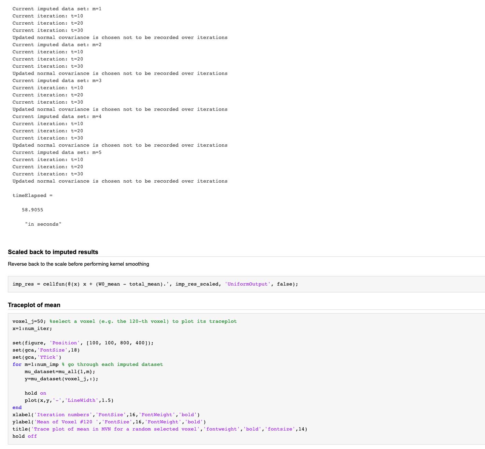
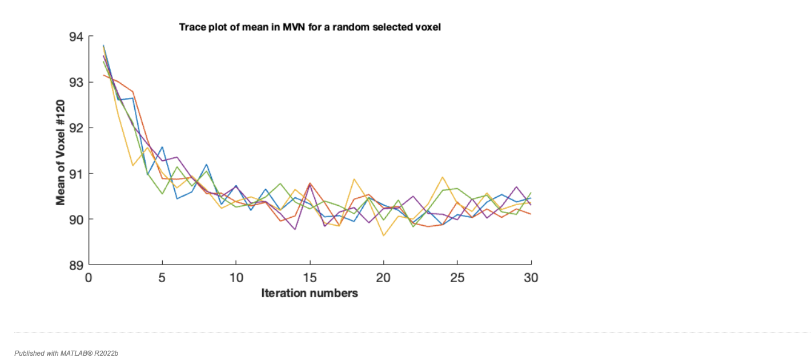

# HIMA
This repository contains the code to implement the **H**igh D**i**mentionsal **M**ultiple Imput**a**tion (**HIMA**) model. 
HIMA introduces a new computational strategy Under MCMC and Bayesian models for sampling large covariance matrices based on a robustly estimated posterior mode, which drastically enhances computational efficiency and numerical stability.  

Specifically, the "**HIMA**" folder includes:

1. Matlab code for implementing the HIMA model to impute missing data in a dataset stored in an "n*p" matrix, where

   - "*HIMA.m*" is the main function for the HIMA algorithm,

   - "*Get_Cov_EB.m*", "*hypergeometric2f1.m*", "*nearestSPD.m*" are auxiliary functions,

   - "HIMA_demo.m" shows a demo to use the functions above to implement HIMA. 

    
2. A live script (which is the Matlab version of Rmarkdown) to implement HIMA on synthetic data ("*HIMA_demo.html*").

*****************************************************************************************************************************************************************************************************
Here is a demonstration of HIMA implementation on a synthetic dataset with dimensions n*p (sample size n=58, number of variables p=100).

\

\

\

